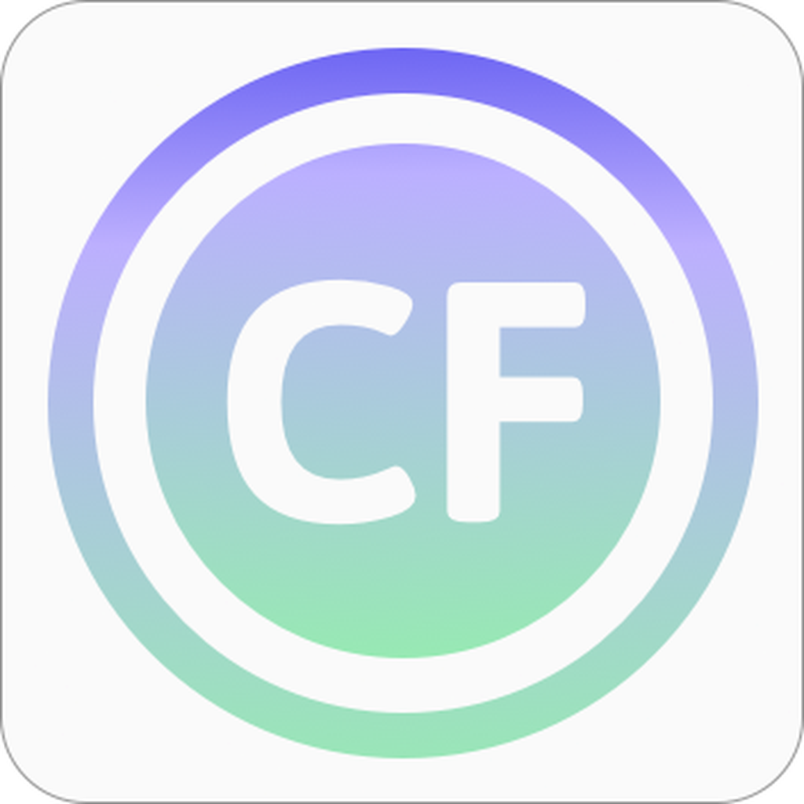
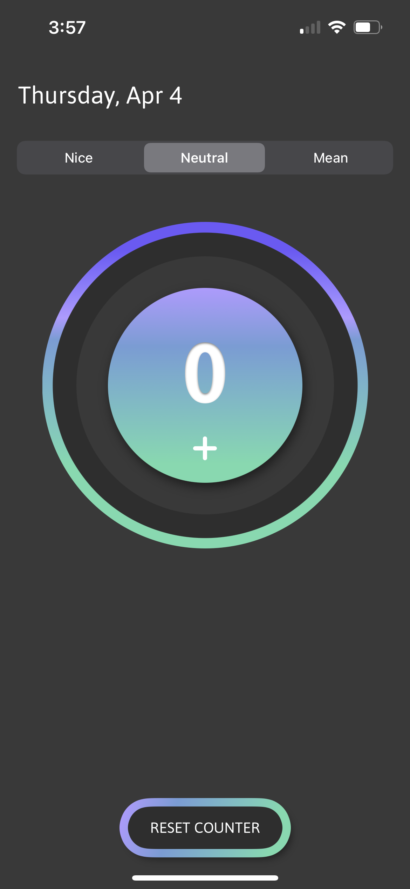
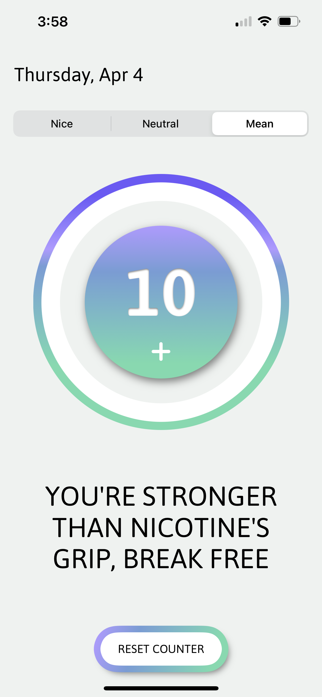
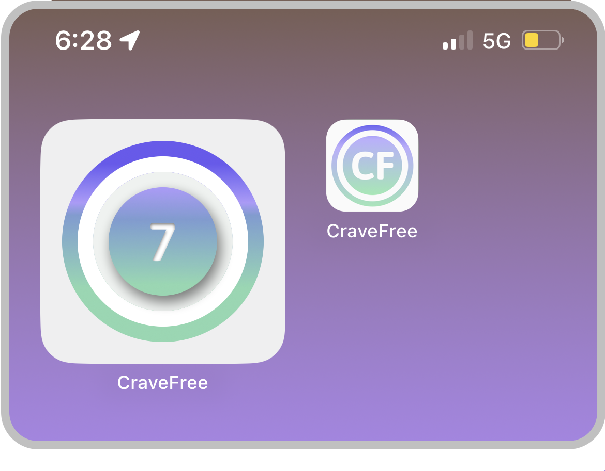

<!-- PROJECT LOGO -->
 

    

<!-- ABOUT THE PROJECT -->
# CraveFree 

CraveFree is a project designed to support individuals struggling with nicotine addiction by providing a simple yet effective tool to track cravings and offer encouragement on their journey.

With the tap of a button, users can log every time they have a craving. A counter that can be displayed prominently on their home screen via a widget serves as a visual reminder of their progress
with every resisted craving. With each button press, a randomly chosen "mantra" will be displayed to provide users with motivational messages to stay strong during challenging moments.
Users can customize the tone of the mantras - whether they prefer gentle encouragement or a more assertive approach, CraveFree has three different tone options to suit individual 
preferences and motivational styles.

## Features

* A button users can press to log cravings & satisfying haptic feedback with every tap
* Visual representation of progress with a counter in the app and on the home screen via a widget
* Motivational mantras with a customizable tone, generated randomly from a collection
* Three different options for tone
* Current date display
* Button to reset the counter at any time

#### Dark & Light Mode

     
&nbsp; &nbsp; &nbsp; &nbsp;
     

#### Widget

 
    

## Our Team

CraveFree is the result of collaborative efforts from a team where I served as our lead developer, Jackelyn Toral as our project manager, and Adriana Silva as our lead designer. 

## Motivation & Process

Our goal for this project was to create a tool to support nicotine users who are trying to quit in an empathetic, straightforward, and honest way. It was important to us for the 
app to be simple and easy to use, and it was especially crucial to me as the lead developer to make sure that the features most important to us - the widget, the button, and the counter - were implemented 
well and felt good to use. 

(<a href="#readme-top">back to top</a>)

<!-- LESSONS LEARNED - show code snippets and/or screenies to accompany these-->
## Lessons Learned

### Coding 

* ***The widget:***
My biggest challenge for this project was learning how to add a widget extension and making it update to show the tracked cravings after the button was pressed in the app. Working with widgets also taught me a lot about how to share data between views.

* ***Layouts with SwiftUI:***
This project was also a great opportunity for me to refine my ability to create a layout using SwiftUI. Translating the design my team came up with accurately into code was challenging, especially as I ran into layout constraints, but it also really fun to figure out how to work around those, and I learned a lot!

* ***Haptics:***
Something I was really excited to learn how to do was adding haptic feedback to our app, and this was my introduction to how haptics work in Swift. 

* ***Accessibility:***
I learned about various accessibility features, such as accessibility labels and Dark & Light mode, and how to implement them in our app. 

* Other things I learned about
  * Adding the date (this was surprisingly challenging)
  * Making different kinds of buttons, alerts, and pickers
  * Creating custom gradients and adding custom fonts

---

<!-- Unsure if this is worth saying but it feels relevant to me! -->

### Design & Project Management Skills

Even though I was mainly focused on developing the code, this project actually taught me a lot about design & user testing, about how to work with a team to manage time & 
the scope of a project, and about how to approach and solve problems in general. The process of refining the ideas we came up with and turning them into a solution that we could execute well 
was honestly incredibly challenging, but it was also incredibly rewarding in the end.

#### I also uploaded our project to TestFlight so we could get feedback from our users, and this was a major achievement for myself and my whole team.

#### I ended this challenge with a lot more confidence in my abilities to design a user-friendly app, *problem-solve*,  *gather & implement feedback from users*, *set priorities,* and *break a project down into manageable tasks.*

(<a href="#readme-top">back to top</a>)

<!-- FUTURE GOALS -->
## Future Goals/Things I'm Working On
* Adding onboarding to the app to clarify its use to new users - I would like to try using TipKit for this
  
* Integrating the app with WatchOS to make it even more readily accessible
  
* Adding interactivity to the widget
  
* Making the counter reset daily
  
* Adding a log to keep track of cravings over time
  
* Adding more mantras to the collection of mantras and refining the function use to generate them
  * Making sure the same mantra doesn't appear multiple times in a row
  * Using AI to generate them

(<a href="#readme-top">back to top</a>)

## Demos

Changing the tone of the mantras:

https://github.com/kitcurio/CraveFree/assets/80923104/742cc25c-8fd1-40be-9a8e-e9679d0167da

Widget updating on home screen:

https://github.com/kitcurio/CraveFree/assets/80923104/add14a64-fcb2-4a59-b51f-2f93c3a3a529

